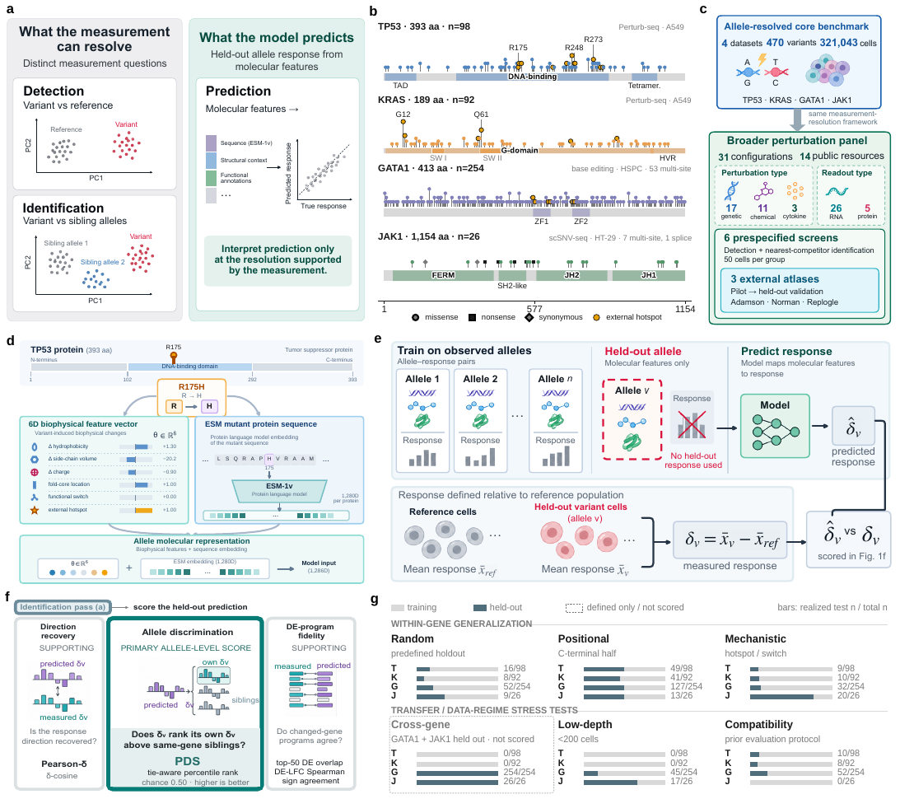

<a id="top"></a>

<div align="center">

<h1>PertResolve</h1>
<h3>Measurement resolution for<br>fine-grained perturbation prediction</h3>

<p>Separate what the measurement resolves from what the model learns.</p>

<p>
  <a href="https://github.com/Boom5426/PertResolve/actions/workflows/tests.yml"></a>
  <a href="pyproject.toml"></a>
  <a href="LICENSE"></a>
  <a href="https://huggingface.co/datasets/Boom5426/PertResolve_Bench"></a>
</p>

<p>
  <a href="manuscript/PertResolve_manuscript.pdf"><b>Paper</b></a> &nbsp;·&nbsp;
  <a href="manuscript/PertResolve_SI.pdf"><b>Supplement</b></a> &nbsp;·&nbsp;
  <a href="#quick-start"><b>Quick start</b></a> &nbsp;·&nbsp;
  <a href="#use-pertresolve"><b>Usage</b></a> &nbsp;·&nbsp;
  <a href="#benchmark"><b>Benchmark</b></a> &nbsp;·&nbsp;
  <a href="#reproduce"><b>Reproduce</b></a> &nbsp;·&nbsp;
  <a href="#citation"><b>Cite</b></a>
</p>

</div>

**PertResolve** is a measurement-resolution framework for interpreting fine-grained perturbation prediction. It separates **perturbation detection**, **perturbation identification** and **response prediction**, and interprets model performance against the distinctions reproducibly supported by the measurement.

<table align="center">
  <tr>
    <td align="center" width="25%"><h3>470</h3><sub>coding-variant<br>conditions</sub></td>
    <td align="center" width="25%"><h3>321,043</h3><sub>cells in<br>the allele arm</sub></td>
    <td align="center" width="25%"><h3>31</h3><sub>perturbation<br>configurations</sub></td>
    <td align="center" width="25%"><h3>14</h3><sub>public<br>resources</sub></td>
  </tr>
</table>

<p align="center">
  <a href="assets/fig1.pdf"></a>
  <br>
  <sub>PertResolve framework overview · Figure 1 · <a href="assets/fig1.pdf">Open vector figure ↗</a></sub>
</p>

### ✨ Why PertResolve?

A predictor can recover the transcriptional programme shared by variants of a gene without identifying the correct allele. PertResolve uses split-half measurement references to distinguish **measurement-limited** comparisons from **model-limited** ones, and examines how competitor geometry, sampling depth and benchmark size affect evaluation. See the [paper](manuscript/PertResolve_manuscript.pdf) for the evaluated regimes and their scope.

<table>
  <tr>
    <td valign="top" width="33%">
      <b>🔬 Measure your dataset</b><br><br>
      Quantify detection, identification and split-half reproducibility before interpreting model scores.<br><br>
      <a href="#measure-your-dataset">Resolution diagnostics →</a>
    </td>
    <td valign="top" width="33%">
      <b>🎯 Evaluate your predictions</b><br><br>
      Assess response direction and full-pool allele identification with PertResolve-Eval.<br><br>
      <a href="#evaluate-your-predictions">Prediction evaluation →</a>
    </td>
    <td valign="top" width="33%">
      <b>🧬 Explore the benchmark</b><br><br>
      Find variant annotations, evaluation partitions, public data and paper-level result tables.<br><br>
      <a href="#benchmark">PertResolve-Bench →</a>
    </td>
  </tr>
</table>

<a id="quick-start"></a>

## 🚀 Quick start

**Python 3.10+ · NumPy and pandas for the core diagnostics.** Run the bundled demo without downloading an atlas:

```bash
git clone https://github.com/Boom5426/PertResolve.git
cd PertResolve
python -m pip install -e .
python examples/run_resolution_demo.py
```

> [!NOTE]
> The demo uses **160 derived profiles with 939 features** and reports the independent measurement and model-ranking quantities. It checks the software interface; **its scores are not biological results from the TP53 benchmark**. [Demo provenance](data/demo/README.md).

<details>
<summary><b>Environment setup and optional dependencies</b></summary>

A fresh environment is recommended. From the repository root:

```bash
python -m venv .venv
source .venv/bin/activate  # Windows PowerShell: .venv\Scripts\Activate.ps1
python -m pip install --upgrade pip
python -m pip install -e .
```

Install only the extras needed for your workflow:

| Workflow | Install |
| :--- | :--- |
| AnnData input and dimension reduction | `python -m pip install -e ".[io]"` |
| Prediction metrics and paper-analysis dependencies | `python -m pip install -e ".[bench]"` |
| Tests | `python -m pip install -e ".[dev]"` |
| Protein-language-model feature extraction | `python -m pip install -e ".[esm]"` |

For the ESM extra, select a PyTorch build appropriate for your hardware. Dependency definitions live in [`pyproject.toml`](pyproject.toml).

</details>

<a id="use-pertresolve"></a>

## 🧭 Use PertResolve

<a id="measure-your-dataset"></a>

### 🔬 Measure your dataset

Provide a cell-by-feature matrix `X`, one perturbation label per row, and the reference label:

```python
from pertresolve.resolution import resolution_report

report = resolution_report(
    X, labels, control="non-targeting", depth=50,
)
print(report.summary())
```

The report keeps four outputs separate:

| Output | Question answered |
| :--- | :--- |
| **🔎 Detection** | Does the perturbation separate from its reference? |
| **🧭 Identification** | Does it separate from its nearest competitor? |
| **🔁 Split-half reproducibility reference** | Can a disjoint measurement identify the same perturbation? |
| **📈 Model-ranking resolution** | How reliably does this benchmark recover the ordering of the diagnostic predictor family? |

**For an AnnData file:**

```bash
python -m pip install -e ".[io]"
pertresolve-resolution data.h5ad \
  --perturbation-key perturbation \
  --control non-targeting \
  --depth 50 \
  --out /tmp/pertresolve-report
```

The CLI saves `resolution_report.json` and, when detection is computed, `resolution_window.csv`. At `depth=50`, the diagnostic requires **at least 200 cells per perturbation** to form four disjoint groups.

> [!TIP]
> **Input representation matters.** The CLI does not automatically normalize counts, log-transform expression or select highly variable genes. It evaluates the matrix or embedding you supply.

<details>
<summary><b>Run the Python example on the bundled demo</b></summary>

Run from the repository root:

```python
import numpy as np
from pertresolve.resolution import resolution_report

with np.load("data/demo/pertresolve_resolution_demo.npz", allow_pickle=False) as demo:
    X = demo["X"]
    labels = demo["labels"].astype(str)
    control = str(demo["control"])
    depth = int(demo["depth"])

report = resolution_report(
    X, labels, control=control, depth=depth,
    n_seeds=4, seed=7, n_boot=200,
)
print(report.summary())
```

</details>

<details>
<summary><b>Choose an AnnData layer or embedding</b></summary>

By default, the CLI reads `adata.X` and reduces it to 50 principal components when the input has more than 50 features. It does not normalize, apply `log1p`, or select highly variable genes. The NumPy API uses the supplied matrix directly.

| Input | CLI option |
| :--- | :--- |
| `adata.X` | Default |
| A named expression layer | `--layer counts` |
| A precomputed embedding in `adata.obsm` | `--use-rep X_pca` |
| Keep all features of the selected expression matrix | `--n-components 0` |

Choose the expression layer or precomputed embedding that defines your evaluation. For memory-constrained runs, prefer a compact representation rather than densifying a large cell-by-gene matrix.

The saved JSON includes the preprocessing and sampling configuration. Keep this information with your results: changing the representation changes the measurement question.

</details>

<a id="evaluate-your-predictions"></a>

### 🎯 Evaluate your predictions

Install `python -m pip install -e ".[bench]"`. For your model's `predicted_deltas` and the measured `real_deltas`, keyed by variant within the **same gene**:

```python
from pertresolve.metrics import evaluate_variant

scores = evaluate_variant(
    pred_delta=predicted_deltas["R175H"],
    real_delta=real_deltas["R175H"],
    target_variant="R175H",
    all_real_deltas=real_deltas,
    candidate_variants=list(real_deltas),
)
print(f"PDS:       {scores['PDS_cos']:.3f}")
print(f"Pearson-δ: {scores['pearson_delta']:.3f}")
```

**PDS tests allele specificity; Pearson-δ tests response direction.** For paper-style evaluation, retain the full same-gene candidate pool, including the target and both training and held-out candidates. Score held-out queries without giving their measured responses to the predictor. Optional differential-expression inputs add DE-program fidelity metrics; see [`evaluate_variant`](pertresolve/metrics.py).

<details>
<summary><b>Interpretation notes and the paper-specific protocols</b></summary>

Detection and identification answer different comparisons and are not sequential pass/fail gates. The split-half value is a **within-experiment empirical reproducibility reference**, not a mathematical upper bound or a substitute for independent experiments. Model-ranking reliability depends jointly on measurement reproducibility, the model difference and benchmark size.

The generic diagnostic is not a drop-in reproduction of every paper analysis. Its default graded predictors interpolate toward a shuffled response, and `smallest_resolved_gap` is measured in **mixing-weight units (Δα)**. The paper's controlled-predictor and benchmark-size analyses use their specified constructions; the realized **ΔPDS** in Fig. 6g is a different quantity. Use the dedicated analysis scripts for those results.

Likewise, the broader count-space panel and the depth-ladder analyses use different preprocessing and inclusion rules. Compare results within the stated representation, cohort, candidate pool and sampling protocol. The [manuscript Methods](manuscript/PertResolve_manuscript.pdf) and [analysis index](scripts/analysis/README.md) provide the definitions.

</details>

<a id="benchmark"></a>

## 🧬 PertResolve-Bench

Two complementary analysis arms connect allele-level prediction to broader perturbation measurement:

| Allele-resolved dataset | Variant conditions | Cellular context | Assay |
| :--- | ---: | :--- | :--- |
| **TP53** | 98 | A549 | Perturb-seq |
| **KRAS** | 92 | A549 | Perturb-seq |
| **GATA1** | 254 | Human haematopoietic stem and progenitor cells | Base editing |
| **JAK1** | 26 | HT-29 | scSNV-seq |

The allele-resolved arm comprises **321,043 cells, including dataset-specific reference cells**. Its metadata table has 470 variant-condition rows and two additional WT reference rows. The **broader panel contains 31 configurations nested within 14 public resources**, spanning genetic, chemical and cytokine perturbations with RNA and surface-protein readouts.

**[Explore the Hugging Face dataset ↗](https://huggingface.co/datasets/Boom5426/PertResolve_Bench)** &nbsp;·&nbsp; [Variant metadata](data/pertresolve_bench.csv) &nbsp;·&nbsp; [Data sources](data/README.md) &nbsp;·&nbsp; [Supplementary Data 1](manuscript/supplementary_data_1_datasets.xlsx)

GitHub contains the lightweight metadata and demo. Hugging Face hosts the listed compact derived products, including response vectors and embeddings; it does not mirror every original cell-by-gene matrix. See the dataset card for the exact release contents and provenance.

<details>
<summary><b>Download the benchmark assets</b></summary>

```bash
python -m pip install huggingface_hub
```

```python
from huggingface_hub import snapshot_download

snapshot_download(
    repo_id="Boom5426/PertResolve_Bench",
    repo_type="dataset",
    local_dir="data_external/PertResolve_Bench",
)
```

Some paper analyses additionally require source matrices or model predictions in the processed-data workspace. The compact release is not a replacement for every original input. See [data preparation](data/README.md).

</details>

<a id="reproduce"></a>

## 🔁 Reproduce the paper

Start at the level you need:

| Goal | Entry point | Inputs |
| :--- | :--- | :--- |
| **Try the software** | [Bundled demo](examples/run_resolution_demo.py) | Repository only |
| **Inspect paper results** | [Result-table index](results/canonical/README.md) | Committed derived tables |
| **Rerun analyses** | [Analysis generators](scripts/analysis/README.md) | Specified processed matrices and predictions |

For repository tests:

```bash
python -m pip install -e ".[dev,bench]"
pytest
```

<details>
<summary><b>Paper-level commands and external-data paths</b></summary>

Provide your processed-data workspace explicitly. Atlas analyses also require the corresponding public `.h5ad` inputs; install `.[io,bench]` for AnnData-based runs.

```bash
export PERTRESOLVE_DATA=/absolute/path/to/processed-pertresolve-workspace
export PERTRESOLVE_ATLAS_DIR=/absolute/path/to/perturbation-atlases

# Split-half reproducibility reference
python scripts/analysis/oracle_ceiling.py \
  --base "$PERTRESOLVE_DATA" --out /tmp/pertresolve-reference

# Canonical multi-seed prediction evaluation
python scripts/analysis/score_definitive.py \
  --base "$PERTRESOLVE_DATA" --out /tmp/pertresolve-scores

# Split-half top-k recovery
python scripts/analysis/split_half_topk.py \
  --base "$PERTRESOLVE_DATA" --out /tmp/pertresolve-topk

# Broader-panel analysis for one AnnData resource
python scripts/analysis/resolution_panel_v2.py \
  --h5ad /path/to/resource.h5ad --name resource_name \
  --perturbation-key perturbation --control non-targeting \
  --out /tmp/pertresolve-panel

# Supplementary Data 1 workbook
python scripts/make_dataset_table.py \
  --out /tmp/supplementary_data_1_datasets.xlsx
```

Write reruns to scratch locations and compare them with the committed tables. Analysis output guards protect the repository's `results/` tree. The [project structure](PROJECT_STRUCTURE.md) describes the layout and input requirements.

</details>

> [!IMPORTANT]
> The current checkout includes the manuscript, Supplementary Information and result tables. The final figure-generation source bundle is not included in this staging release; the overview above is an excerpt of the existing manuscript figure.

<a id="citation"></a>

## 📚 Citation

This repository accompanies **[Measurement resolution constrains fine-grained perturbation prediction](manuscript/PertResolve_manuscript.pdf)**. Please cite the manuscript when using PertResolve or PertResolve-Bench; machine-readable metadata is available in [`CITATION.cff`](CITATION.cff).

<details>
<summary><b>BibTeX</b></summary>

```bibtex
@article{Li2026PertResolve,
  title  = {Measurement resolution constrains fine-grained perturbation prediction},
  author = {Li, Bo and Zhang, Chengyang and Li, Mengran and Zhang, Bob and
            Wang, Lin and Tang, Zhenchao and Liu, Jun and Liu, Chengliang and
            Wei, Chen and Yi, Yuhao and Lv, Jiancheng and Zhang, Yang},
  year   = {2026},
  note   = {PertResolve manuscript}
}
```

</details>

**License & support.** The code is released under the [MIT License](LICENSE); original datasets retain their source terms. For questions or reproducible bug reports, please [open an issue](https://github.com/Boom5426/PertResolve/issues). Include the package version, input representation and a minimal example where possible.

---

<p align="center">
  <b>Measure the distinction. Interpret the prediction.</b><br>
  <sub><a href="#top">Back to top ↑</a></sub>
</p>
