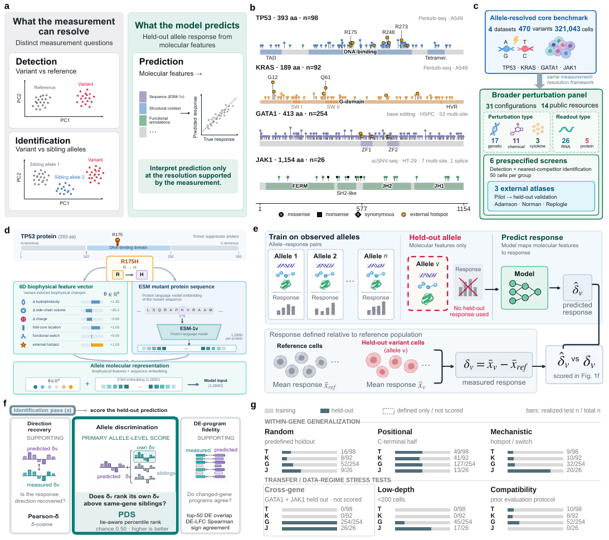

<a id="top"></a>

<div align="center">

<h1>PertResolve</h1>
<h3>面向细粒度扰动预测的测量分辨率框架</h3>

<p>
  <a href="README.md">English</a> · <strong>简体中文</strong>
</p>

<p>
  
  
  <a href="pyproject.toml"></a>
  <a href="LICENSE"></a>
  <a href="manuscript/PertResolve_manuscript.pdf"></a>
  <a href="https://huggingface.co/datasets/Boom5426/PertResolve_Bench"></a>
</p>

<p><strong>先明确测量能够分辨什么，再解释模型学到了什么。</strong></p>

<p>
  <a href="https://boom5426.github.io/PertResolve/">🌐 项目主页</a> ·
  <a href="#quick-start">🚀 快速开始</a> ·
  <a href="https://huggingface.co/datasets/Boom5426/PertResolve_Bench">🤗 数据</a> ·
  <a href="#reproduce">🧪 复现</a> ·
  <a href="manuscript/PertResolve_manuscript.pdf">📄 论文</a> ·
  <a href="CITATION.cff">📚 引用</a>
</p>

</div>

**PertResolve** 是一个用于解释细粒度扰动预测的测量分辨率框架。它将 **扰动检测（perturbation detection）**、**扰动鉴别（perturbation identification）** 与 **响应预测（response prediction）** 分开，并根据实验测量能够稳定、可重复支持的生物学区分来解释模型性能。

<table align="center">
  <tr>
    <td align="center" width="25%"><h3>470</h3><sub>编码变体条件</sub></td>
    <td align="center" width="25%"><h3>321,043</h3><sub>等位变体分析中的<br>单细胞数量</sub></td>
    <td align="center" width="25%"><h3>31</h3><sub>扰动配置</sub></td>
    <td align="center" width="25%"><h3>14</h3><sub>公共<br>数据资源</sub></td>
  </tr>
</table>

<p align="center">
  <a href="assets/fig1.pdf"></a>
  <br>
  <sub>PertResolve 框架概览 · Figure 1 · <a href="assets/fig1.pdf">打开矢量图 ↗</a></sub>
</p>

### ✨ 为什么需要 PertResolve？

一个预测模型可能能够恢复同一基因不同变体共享的转录程序，却仍无法识别正确的等位变体。PertResolve 使用 split-half 独立测量参考，将 **测量受限（measurement-limited）** 的比较与 **模型受限（model-limited）** 的比较区分开来，并进一步分析竞争者几何结构、采样深度和 benchmark 规模如何影响模型评价。具体评价场景及适用范围见 [论文](manuscript/PertResolve_manuscript.pdf)。

<table>
  <tr>
    <td valign="top" width="33%">
      <b>🔬 测量你的数据集</b><br><br>
      在解释模型分数之前，先量化 detection、identification 和 split-half reproducibility。<br><br>
      <a href="#measure-your-dataset">测量分辨率诊断 →</a>
    </td>
    <td valign="top" width="33%">
      <b>🎯 评价你的预测结果</b><br><br>
      使用 PertResolve-Eval 同时评估响应方向与全候选池中的等位变体鉴别能力。<br><br>
      <a href="#evaluate-your-predictions">预测评价 →</a>
    </td>
    <td valign="top" width="33%">
      <b>🧬 探索 benchmark</b><br><br>
      获取变体注释、评价划分、公共数据以及论文结果表。<br><br>
      <a href="#benchmark">PertResolve-Bench →</a>
    </td>
  </tr>
</table>

<a id="quick-start"></a>

## 🚀 快速开始

**Python 3.10+ · 核心诊断依赖 NumPy 和 pandas。** 无需下载完整 atlas，即可运行仓库自带 demo：

```bash
git clone https://github.com/Boom5426/PertResolve.git
cd PertResolve
python -m pip install -e .
python examples/run_resolution_demo.py
```

> [!NOTE]
> Demo 使用 **160 个衍生 profile、939 个特征**，用于展示独立测量与模型排序相关的输出。它主要验证软件接口；**其中的分数并不是 TP53 benchmark 的生物学结果**。参见 [Demo 数据来源](data/demo/README.md)。

<details>
<summary><b>环境配置与可选依赖</b></summary>

建议使用新的独立环境。在仓库根目录运行：

```bash
python -m venv .venv
source .venv/bin/activate  # Windows PowerShell: .venv\Scripts\Activate.ps1
python -m pip install --upgrade pip
python -m pip install -e .
```

根据你的工作流安装相应扩展：

| 工作流 | 安装命令 |
| :--- | :--- |
| AnnData 输入与降维 | `python -m pip install -e ".[io]"` |
| 预测指标与论文分析依赖 | `python -m pip install -e ".[bench]"` |
| 测试 | `python -m pip install -e ".[dev]"` |
| 蛋白语言模型特征提取 | `python -m pip install -e ".[esm]"` |

若使用 ESM 扩展，请根据你的硬件选择合适的 PyTorch 版本。完整依赖定义见 [`pyproject.toml`](pyproject.toml)。

</details>

<a id="use-pertresolve"></a>

## 🧭 使用 PertResolve

<a id="measure-your-dataset"></a>

### 🔬 测量你的数据集

提供 cell-by-feature 矩阵 `X`、每个细胞对应的扰动标签以及 reference 标签：

```python
from pertresolve.resolution import resolution_report

report = resolution_report(
    X, labels, control="non-targeting", depth=50,
)
print(report.summary())
```

报告将四类输出明确分开：

| 输出 | 回答的问题 |
| :--- | :--- |
| **🔎 Detection** | 该扰动能否与 reference 区分？ |
| **🧭 Identification** | 该扰动能否与其最近的竞争者区分？ |
| **🔁 Split-half reproducibility reference** | 一个不重叠的独立测量能否识别出同一扰动？ |
| **📈 Model-ranking resolution** | 该 benchmark 能以多高可靠性恢复诊断性预测器家族之间的排序？ |

**对于 AnnData 文件：**

```bash
python -m pip install -e ".[io]"
pertresolve-resolution data.h5ad \
  --perturbation-key perturbation \
  --control non-targeting \
  --depth 50 \
  --out /tmp/pertresolve-report
```

CLI 会保存 `resolution_report.json`；若计算 detection，还会保存 `resolution_window.csv`。当 `depth=50` 时，该诊断要求 **每个扰动至少有 200 个细胞**，以构建四个互不重叠的细胞组。

> [!TIP]
> **输入表征会影响结果。** CLI 不会自动进行 counts normalization、log transform 或高变基因筛选。它评价的是你实际提供的矩阵或 embedding。

<details>
<summary><b>在自带 demo 上运行 Python 示例</b></summary>

在仓库根目录运行：

```python
import numpy as np
from pertresolve.resolution import resolution_report

with np.load("data/demo/pertresolve_resolution_demo.npz", allow_pickle=False) as demo:
    X = demo["X"]
    labels = demo["labels"].astype(str)
    control = str(demo["control"])
    depth = int(demo["depth"])

report = resolution_report(
    X, labels, control=control, depth=depth,
    n_seeds=4, seed=7, n_boot=200,
)
print(report.summary())
```

</details>

<details>
<summary><b>选择 AnnData layer 或 embedding</b></summary>

默认情况下，CLI 读取 `adata.X`；当输入特征数超过 50 时，会降至 50 个主成分。它不会自动做 normalization、`log1p` 或高变基因筛选。NumPy API 则直接使用你提供的矩阵。

| 输入 | CLI 选项 |
| :--- | :--- |
| `adata.X` | 默认 |
| 指定表达层 | `--layer counts` |
| `adata.obsm` 中预计算的 embedding | `--use-rep X_pca` |
| 保留所选表达矩阵的全部特征 | `--n-components 0` |

请选择与你的评价问题相对应的表达层或预计算 embedding。在内存受限的情况下，优先使用紧凑表征，而不是将大型 cell-by-gene 矩阵强制转为 dense 格式。

保存的 JSON 会记录预处理与采样配置。建议将这些信息与结果一起保留，因为表征的变化会改变实际回答的测量问题。

</details>

<a id="evaluate-your-predictions"></a>

### 🎯 评价你的预测结果

先安装 `python -m pip install -e ".[bench]"`。假设模型预测的 `predicted_deltas` 和实测的 `real_deltas` 均按 **同一基因内的变体** 组织：

```python
from pertresolve.metrics import evaluate_variant

scores = evaluate_variant(
    pred_delta=predicted_deltas["R175H"],
    real_delta=real_deltas["R175H"],
    target_variant="R175H",
    all_real_deltas=real_deltas,
    candidate_variants=list(real_deltas),
)
print(f"PDS:       {scores['PDS_cos']:.3f}")
print(f"Pearson-δ: {scores['pearson_delta']:.3f}")
```

**PDS 检验等位变体特异性；Pearson-δ 检验响应方向。** 对于论文中的评价设置，应保留完整的同基因候选池，包括目标变体以及训练和 held-out 候选。对 held-out query 评分时，不应将其真实测量响应提供给预测模型。可选的 differential-expression 输入还可用于计算 DE-program fidelity 指标；详见 [`evaluate_variant`](pertresolve/metrics.py)。

<details>
<summary><b>解释注意事项与论文特定协议</b></summary>

Detection 和 identification 回答的是不同的比较问题，它们不是必须依次通过的串行 pass/fail gate。Split-half 数值是 **实验内部的经验性可重复性参考**，不是数学意义上的性能上界，也不能替代真正的独立实验。模型排序可靠性同时取决于测量可重复性、模型间性能差异和 benchmark 规模。

通用诊断接口并不能一键复现论文中的所有分析。其默认 graded predictors 通过向 shuffled response 插值构造，`smallest_resolved_gap` 使用的是 **mixing-weight 单位（Δα）**。论文中的 controlled-predictor 与 benchmark-size 分析使用各自明确规定的构造；Fig. 6g 中实际实现的 **ΔPDS** 是另一种量。若要复现论文结果，请使用对应的专用分析脚本。

同样，更广泛的 count-space panel 与 depth-ladder 分析采用不同的预处理和纳入规则。比较结果时，应限定在相同的表征、cohort、候选池和采样协议下。[论文 Methods](manuscript/PertResolve_manuscript.pdf) 与 [分析脚本索引](scripts/analysis/README.md) 提供了完整定义。

</details>

<a id="benchmark"></a>

## 🧬 PertResolve-Bench

两个互补的分析部分将等位变体层面的预测与更广泛的扰动测量问题连接起来：

| 等位变体数据集 | 变体条件 | 细胞背景 | 实验类型 |
| :--- | ---: | :--- | :--- |
| **TP53** | 98 | A549 | Perturb-seq |
| **KRAS** | 92 | A549 | Perturb-seq |
| **GATA1** | 254 | 人造血干细胞与祖细胞 | Base editing |
| **JAK1** | 26 | HT-29 | scSNV-seq |

等位变体分析部分共包含 **321,043 个细胞，其中包括各数据集对应的 reference cells**。其 metadata 表包含 470 个变体条件，以及额外两个 WT reference 条目。**更广泛的 perturbation panel 包含 14 个公共资源中的 31 种配置**，覆盖遗传扰动、化学扰动和细胞因子扰动，并包含 RNA 与表面蛋白 readout。

**[浏览 Hugging Face 数据集 ↗](https://huggingface.co/datasets/Boom5426/PertResolve_Bench)** &nbsp;·&nbsp; [变体 metadata](data/pertresolve_bench.csv) &nbsp;·&nbsp; [数据来源](data/README.md) &nbsp;·&nbsp; [Supplementary Data 1](manuscript/supplementary_data_1_datasets.xlsx)

GitHub 仓库提供轻量级 metadata 与 demo；Hugging Face 托管已发布的紧凑衍生数据，包括 response vectors 和 embeddings，但不会镜像所有原始 cell-by-gene 矩阵。具体发布内容与数据来源请查看 dataset card。

<details>
<summary><b>下载 benchmark 数据</b></summary>

```bash
python -m pip install huggingface_hub
```

```python
from huggingface_hub import snapshot_download

snapshot_download(
    repo_id="Boom5426/PertResolve_Bench",
    repo_type="dataset",
    local_dir="data_external/PertResolve_Bench",
)
```

部分论文分析还需要 processed-data workspace 中的原始矩阵或模型预测结果。紧凑版数据发布并不能替代所有原始输入。详情见 [数据准备说明](data/README.md)。

</details>

<a id="reproduce"></a>

## 🔁 复现论文结果

根据你的目标选择对应入口：

| 目标 | 入口 | 所需输入 |
| :--- | :--- | :--- |
| **体验软件** | [自带 demo](examples/run_resolution_demo.py) | 仅需仓库本身 |
| **查看论文结果** | [结果表索引](results/canonical/README.md) | 已提交的衍生结果表 |
| **重新运行分析** | [分析生成脚本](scripts/analysis/README.md) | 指定的 processed matrices 与 predictions |

运行仓库测试：

```bash
python -m pip install -e ".[dev,bench]"
pytest
```

<details>
<summary><b>论文级复现命令与外部数据路径</b></summary>

请显式指定你的 processed-data workspace。Atlas 分析还需要相应的公共 `.h5ad` 输入；运行基于 AnnData 的分析时请安装 `.[io,bench]`。

```bash
export PERTRESOLVE_DATA=/absolute/path/to/processed-pertresolve-workspace
export PERTRESOLVE_ATLAS_DIR=/absolute/path/to/perturbation-atlases

# Split-half reproducibility reference
python scripts/analysis/oracle_ceiling.py \
  --base "$PERTRESOLVE_DATA" --out /tmp/pertresolve-reference

# Canonical multi-seed prediction evaluation
python scripts/analysis/score_definitive.py \
  --base "$PERTRESOLVE_DATA" --out /tmp/pertresolve-scores

# Split-half top-k recovery
python scripts/analysis/split_half_topk.py \
  --base "$PERTRESOLVE_DATA" --out /tmp/pertresolve-topk

# Broader-panel analysis for one AnnData resource
python scripts/analysis/resolution_panel_v2.py \
  --h5ad /path/to/resource.h5ad --name resource_name \
  --perturbation-key perturbation --control non-targeting \
  --out /tmp/pertresolve-panel

# Supplementary Data 1 workbook
python scripts/make_dataset_table.py \
  --out /tmp/supplementary_data_1_datasets.xlsx
```

建议将重新运行的输出写入临时目录，再与仓库中已提交的 canonical tables 比较。Analysis output guards 会保护仓库内的 `results/` 目录。关于项目结构与输入要求，见 [项目结构说明](PROJECT_STRUCTURE.md)。

</details>

> [!IMPORTANT]
> 本仓库提供支持论文定量结果的分析代码与 canonical derived tables，并包含 manuscript 与 Supplementary Information。最终投稿版本的图形排版文件和 LaTeX 源文件不属于公开软件发布内容；上方概览图是论文 Figure 1 的静态节选。

<a id="citation"></a>

## 📚 引用

本仓库对应论文 **[Measurement resolution constrains fine-grained perturbation prediction](manuscript/PertResolve_manuscript.pdf)**。如使用 PertResolve 或 PertResolve-Bench，请引用该论文；机器可读的引用信息见 [`CITATION.cff`](CITATION.cff)。

<details>
<summary><b>BibTeX</b></summary>

```bibtex
@article{Li2026PertResolve,
  title  = {Measurement resolution constrains fine-grained perturbation prediction},
  author = {Li, Bo and Zhang, Chengyang and Li, Mengran and Zhang, Bob and
            Wang, Lin and Tang, Zhenchao and Liu, Jun and Liu, Chengliang and
            Wei, Chen and Yi, Yuhao and Lv, Jiancheng and Zhang, Yang},
  year   = {2026},
  note   = {PertResolve manuscript}
}
```

</details>

**许可与支持。** 代码采用 [MIT License](LICENSE)；原始数据集仍遵循各自的数据使用条款。如有问题或可复现的 bug，请在 GitHub 上 [提交 issue](https://github.com/Boom5426/PertResolve/issues)。建议同时提供 package 版本、输入表征以及尽可能精简的可复现示例。

---

<p align="center">
  <b>Measure the distinction. Interpret the prediction.</b><br>
  <sub><a href="#top">返回顶部 ↑</a></sub>
</p>